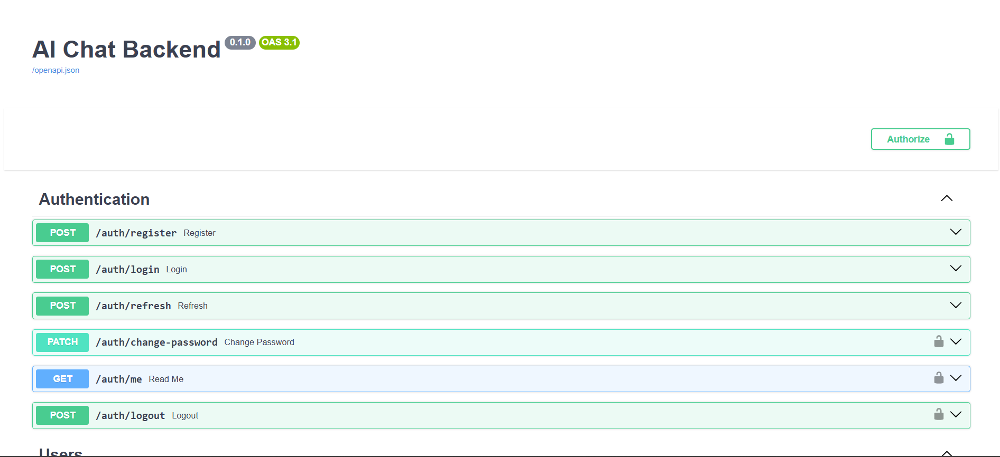
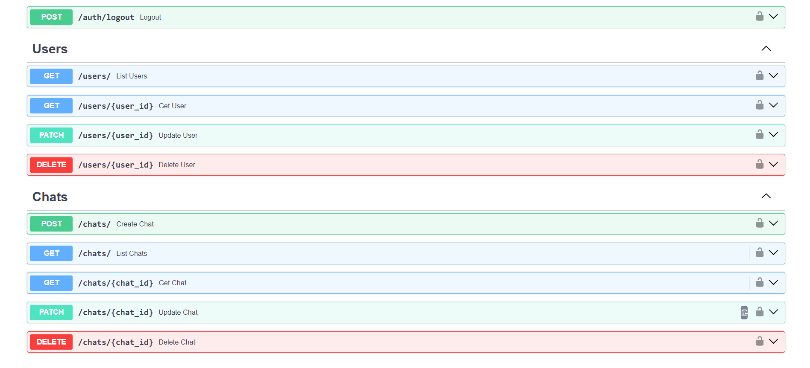
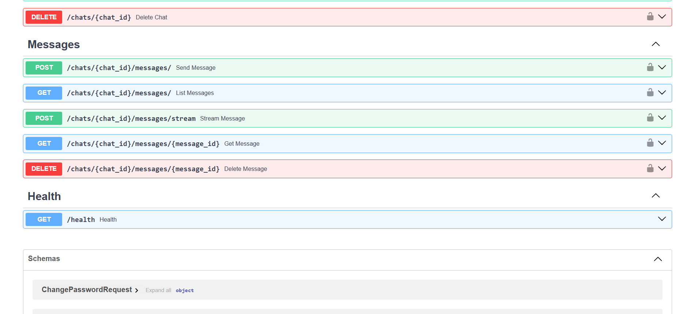
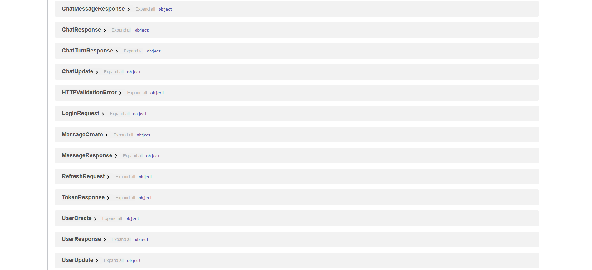

# llm-chat-service

A backend service for an LLM-powered chat application — built with FastAPI, PostgreSQL, JWT auth, and an LLM tool-calling loop, served through OpenRouter.

This README describes **what is actually implemented in this repo**. Where something is intentionally left out, it's listed under *Deliberately not built* with the reason. RAG (document retrieval) is a future addition, not part of this build — see `README-future-roadmap.md`.

## What it does

- **Auth** — Users register and log in and receive a JWT **access + refresh token** pair. Passwords are hashed with bcrypt. Includes change-password, `/me`, logout, and **role-based access control** (`user` / `admin`).
- **Conversations & messages** — Full CRUD for chats and messages, with every route scoped to the owning user (a chat you don't own returns 404, not 403).
- **LLM turns** — A message is persisted, the conversation history is rebuilt from PostgreSQL (the LLM is stateless — the `messages` table *is* the memory), the LLM is called, and the reply is persisted.
- **Two response modes** — a full JSON response, and a **streaming variant over Server-Sent Events** that emits the reply token-by-token. The stream persists partial replies on client disconnect.
- **Tool calling** — the non-streaming turn runs a bounded tool-calling loop. Two tools are implemented: a **calculator** (arithmetic evaluated by walking the AST — it never `eval()`s model output) and **current-time** (timezone-aware). Streaming and tool-calling are currently separate paths.
- **Provider handling** — model **allowlist** (clients may only pick approved models), provider **fallbacks**, SDK-level retries, and **typed error translation** that maps vendor failures (timeout / 429 / 5xx) to precise client status codes. Token usage is logged per call.
- **Ops** — structured JSON logging with per-request context; runs in Docker via `docker compose` (Postgres + API, both health-checked).

## Build order

| Stage | What was added |
|---|---|
| 1. Core API | Health check; User / Chat / Message CRUD |
| 2. Database | PostgreSQL — Users, Chats, Messages (SQLAlchemy 2.0) |
| 3. Auth | Register / login, JWT access + refresh, RBAC, protected routes |
| 4. LLM | OpenRouter integration, streaming (SSE), history persistence |
| 5. Tool calling | Bounded tool loop with calculator + current-time tools |
| 6. Containerization | Dockerfile (non-root) + docker-compose |

## Deliberately not built (with reasons)

# Deliberately not built (with reasons)

These are decisions, not gaps:

- **Alembic migrations** — startup uses `create_all` (creates missing tables, never alters). To be adopted once there's data worth preserving.
- **Streaming + tools together** — in a stream, tool-call arguments arrive as fragments across chunks that must be reassembled by index. Real complexity, no MVP value yet.
- **RAG / vector store / embeddings** — a separate concern layered on top of a chat system that works on its own first. See `README-future-roadmap.md`..

## Folder structure

```
llm-chat-service/
├── app/
│   ├── api/          # routes: auth, users, chats, messages (+ deps)
│   ├── core/         # config, security (JWT/bcrypt), logging, exceptions
│   ├── database/     # SQLAlchemy engine + session
│   ├── models/       # User, Chat, Message ORM models
│   ├── schemas/      # Pydantic request/response schemas
│   ├── services/     # llm_service, chat_service, tool_service
│   └── scripts/      # dev helpers
├── main.py           # app entrypoint (uvicorn main:app)
├── docker-compose.yml
├── dockerfile
├── requirements.txt
└── README.md
```

## Running it

Requires a `.env` with at least:

```
DATABASE_URL=postgresql+psycopg2://chat:chat@db:5432/chatdb
SECRET_KEY=<random-secret>
ALGORITHM=HS256
CORS_ORIGINS=["http://localhost:3000"]
OPENROUTER_API_KEY=sk-or-v1-...
```

Then:

```
docker compose up --build
```

The API is served on `http://localhost:8000` (health check at `/health`, interactive docs at `/docs`).

## API docs

FastAPI generates the OpenAPI spec automatically — no setup required. This isn't deployed; run it locally (`docker compose up --build`) and the docs are served at:

- **Swagger UI** (interactive): `localhost:8000/docs`
- **ReDoc** (clean reference): `localhost:8000/redoc`
- **Raw OpenAPI spec** (import into Postman / generate clients): `localhost:8000/openapi.json`

The screenshot below and the endpoint table are the fastest way to see the surface without running anything.






### Endpoints

| Method | Path | Auth | Description |
|---|---|---|---|
| GET | `/health` | — | Health check |
| POST | `/auth/register` | — | Create a user |
| POST | `/auth/login` | — | Log in — returns access + refresh tokens |
| POST | `/auth/refresh` | refresh token | Exchange a refresh token for a new pair |
| GET | `/auth/me` | access token | Current user |
| PATCH | `/auth/change-password` | access token | Change password |
| POST | `/auth/logout` | access token | Log out (client discards the token) |
| GET | `/users/` | admin | List users |
| GET | `/users/{id}` | self / admin | Get a user |
| PATCH | `/users/{id}` | self / admin | Update a user |
| DELETE | `/users/{id}` | self / admin | Delete a user |
| POST | `/chats/` | access token | Create a chat |
| GET | `/chats/` | access token | List your chats |
| GET | `/chats/{id}` | access token | Get a chat |
| PATCH | `/chats/{id}` | access token | Rename a chat |
| DELETE | `/chats/{id}` | access token | Delete a chat (cascades its messages) |
| POST | `/chats/{id}/messages/` | access token | Send a message — full LLM turn (with tools) |
| POST | `/chats/{id}/messages/stream` | access token | Send a message — streamed over SSE |
| GET | `/chats/{id}/messages/` | access token | List messages in a chat |
| GET | `/chats/{id}/messages/{mid}` | access token | Get one message |
| DELETE | `/chats/{id}/messages/{mid}` | access token | Delete a message |